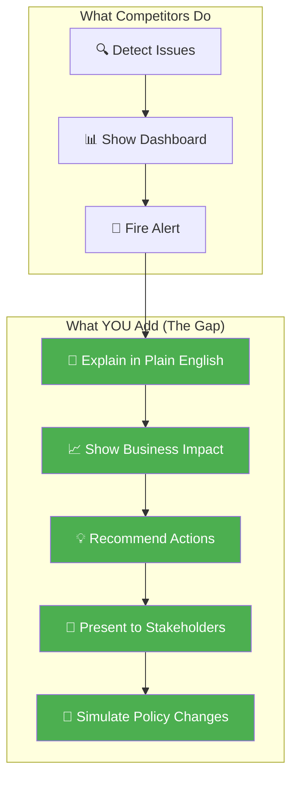
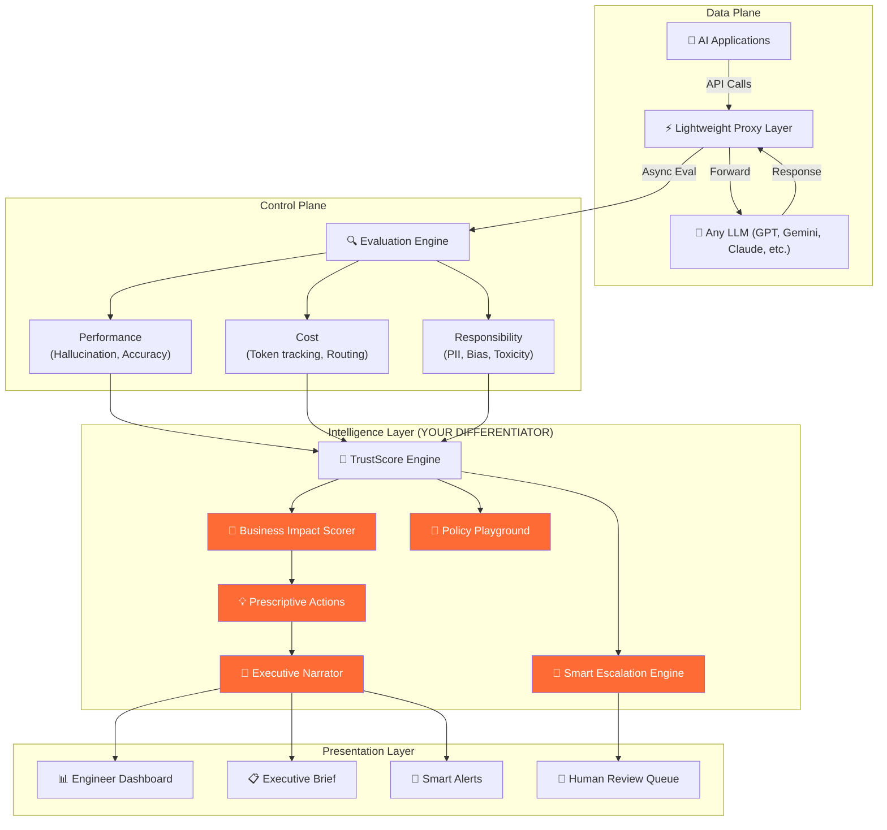

# ControlPlane.ai — Competitive Analysis & Differentiation Strategy

## Market Context (August 2026)

The AI Control Plane market is exploding. Key dynamics:
- **~80% of organizations** have CEO-mandated AI transformations, but only **~11-12% feel prepared** to govern AI agents at scale
- The average enterprise deploys **3+ fragmented orchestration platforms** with no unified oversight
- The "model" is no longer the differentiator — the **control plane infrastructure** surrounding it is where the competitive moat lies
- Fortune 500 companies are projected to have **150,000+ AI agents** by 2028 — governance at that scale is unsolved

---

## Competitor Deep Dives

### 1. Fiddler AI — "The Enterprise Control Plane"

| Aspect | Details |
|--------|---------|
| **Positioning** | Enterprise "system of trust" for AI — the most mature player |
| **Funding/Scale** | Well-funded startup, handles **30M+ traces/day** at enterprise scale |
| **Target Market** | Fortune 500, regulated industries (banking, healthcare) |

**Core Capabilities:**
- **Standardized Telemetry**: Full agentic hierarchy visibility (application → session → agent → trace → span)
- **Centor Models**: Purpose-built, in-environment evaluation models — no data egress, no "LLM-as-a-judge" dependency
- **Inline Enforcement**: The only platform claiming true inline guardrail enforcement at request/response path
- **PII/PHI Detection**: Real-time masking and redaction before data reaches LLM
- **Automated Root Cause Analysis**: Links failures back to specific points in the agentic hierarchy
- **Compliance**: NIST AI RMF, SR 26-2, HIPAA, ISO/IEC 42001

**Strengths:**
- ✅ Most comprehensive enterprise feature set
- ✅ In-environment execution (zero data egress) — huge for regulated industries
- ✅ Proprietary evaluation models (no external LLM dependency)
- ✅ Proven at massive scale (30M+ traces/day)

**Weaknesses:**
- ❌ **Complexity**: Enterprise-focused = steep learning curve, heavy setup
- ❌ **Black-box evaluation**: Centor Models are proprietary — users can't customize evaluation logic easily
- ❌ **No cost optimization**: Monitors cost but doesn't actively **optimize** it (no smart routing)
- ❌ **No business context**: Evaluates AI responses in isolation — doesn't understand *business impact* of failures
- ❌ **Developer-hostile**: Built for platform teams and compliance officers, not the developers building AI apps

---

### 2. Galileo AI (Now Cisco/Splunk) — "Luna Evaluator Engine"

| Aspect | Details |
|--------|---------|
| **Positioning** | Real-time evaluation & guardrails using purpose-built SLMs |
| **Acquired by** | **Cisco** (May 2026), integrated into Splunk Observability |
| **Target Market** | Enterprise DevOps/MLOps teams already using Splunk |

**Core Capabilities:**
- **Luna-2 Models**: 3B and 8B parameter SLMs fine-tuned for evaluation, sub-200ms latency
- **Eval-to-Guardrail Pipeline**: Same metrics used in dev testing are deployed as production runtime guardrails
- **Agentic Metrics**: Tool Error Rate, Tool Selection Quality, Action Advancement, Completion tracking
- **Runtime Protection**: Block, transform, or route unsafe outputs in real-time
- **Insights Engine**: Auto-tuned feedback loops that refine metric accuracy over time

**Strengths:**
- ✅ Ultra-low latency evaluation (sub-200ms) — fastest in market
- ✅ Dedicated SLMs beat generic LLM-as-judge on cost and speed
- ✅ Agentic-specific metrics (tool selection quality, action advancement) — forward-thinking
- ✅ Cisco/Splunk backing = enterprise distribution and trust

**Weaknesses:**
- ❌ **Cisco acquisition = enterprise lock-in**: Being absorbed into Splunk ecosystem limits flexibility
- ❌ **Splunk dependency**: Best value only for existing Splunk customers
- ❌ **No policy-as-code**: Guardrails are configured via UI, not declaratively managed
- ❌ **No cost routing/optimization**: Monitors but doesn't actively reduce spend
- ❌ **No human-in-the-loop workflow**: Blocks or allows, no nuanced escalation to humans

---

### 3. Confident AI / DeepEval — "Open-Source Eval Framework + Platform"

| Aspect | Details |
|--------|---------|
| **Positioning** | Open-source evaluation framework (DeepEval) + enterprise platform (Confident AI) |
| **Model** | Open-source core (Apache 2.0) + commercial SaaS platform |
| **Target Market** | Developer-first, scales to enterprise |

**Core Capabilities:**
- **50+ evaluation metrics**: Faithfulness, hallucination, relevance, coherence, etc.
- **CI/CD Integration**: Run evaluations in your deployment pipeline — catch regressions before production
- **Real-Time Production Monitoring**: Score live traffic, track degradation
- **Automated Feedback Loops**: Production failures auto-converted into regression test cases
- **Cross-functional Dashboard**: PMs and QA can view metrics without writing code

**Strengths:**
- ✅ **Open-source foundation** — developer trust, transparency, customizability
- ✅ **Richest metric library** — 50+ research-backed metrics
- ✅ **Dev-to-prod continuity** — same metrics in CI/CD and production
- ✅ **Automated feedback loops** — production issues become test cases automatically

**Weaknesses:**
- ❌ **Evaluation-focused, not enforcement-focused**: Strong at measuring, weak at *acting* on violations
- ❌ **No inline blocking**: Alerts after the fact rather than intercepting in real-time
- ❌ **No cost intelligence**: No token tracking, no budget enforcement, no cost optimization
- ❌ **No policy framework**: Individual metrics, not a coherent policy system
- ❌ **Fragmented experience**: DeepEval (OSS) and Confident AI (platform) feel like separate products

---

### 4. TrueFoundry — "AI Gateway & Governance Proxy"

| Aspect | Details |
|--------|---------|
| **Positioning** | Centralized governance proxy layer for multi-cloud AI deployments |
| **Focus** | Infrastructure-level enforcement — the "IT ops" approach |
| **Target Market** | Fortune 1000, heavily regulated sectors |

**Core Capabilities:**
- **Unified Gateway**: Single access point for 1000+ LLMs across all providers
- **Policy-as-Code**: Define safety and compliance policies declaratively
- **RBAC**: Role-based access control for teams, users, and service accounts
- **Token-Level Cost Control**: Budget enforcement per user, team, or application
- **Agent Registry**: Centralized registry with governed MCP tool access
- **VPC/On-Prem/Air-gapped**: Maximum deployment flexibility

**Strengths:**
- ✅ **Best cost control**: Per-team, per-app budget enforcement with token-level tracking
- ✅ **True policy-as-code**: Declarative governance that scales
- ✅ **Multi-model routing**: Smart load balancing, fallbacks across 1000+ models
- ✅ **Air-gapped deployment**: Strongest security posture for defense/finance

**Weaknesses:**
- ❌ **Infrastructure-first, intelligence-second**: Great at routing and access control, weak at understanding *what* AI is saying
- ❌ **Limited evaluation depth**: Enforces policies but doesn't deeply analyze response quality
- ❌ **No business-level insights**: Tracks tokens and costs, doesn't connect to business outcomes
- ❌ **Complex setup**: Requires significant DevOps expertise to deploy
- ❌ **No human-in-the-loop**: Binary allow/block — no nuanced escalation workflows

---

### 5. Agent Control — "Open-Source SDK with @control() Decorator"

| Aspect | Details |
|--------|---------|
| **Positioning** | Lightweight, open-source SDK for inline agent governance |
| **Model** | Fully open-source, developer-first |
| **Target Market** | Developers building with LangGraph, CrewAI, etc. |

**Core Capabilities:**
- **@control() Decorator**: Wrap any function to route through the control plane for policy checking
- **Decoupled Policies**: Update safety policies without redeploying agents
- **Framework Agnostic**: Works with LangGraph, CrewAI, and other agent frameworks
- **Hot-Reloadable Rules**: Change policies in real-time
- **Audit Logging**: Track every decision and intervention

**Strengths:**
- ✅ **Simplest integration**: One decorator, done — minimal code changes
- ✅ **Framework agnostic**: No vendor lock-in
- ✅ **Hot-reloadable**: Change policies without redeployment
- ✅ **Fully open-source**: Maximum transparency and community trust

**Weaknesses:**
- ❌ **SDK only, no platform**: No dashboard, no visualization, no analytics
- ❌ **No evaluation intelligence**: Checks against policies but doesn't evaluate response *quality*
- ❌ **No cost tracking**: Zero visibility into AI spending
- ❌ **No drift detection**: Point-in-time checks, no temporal analysis
- ❌ **Limited adoption**: Early-stage project, small community

---

## Feature Comparison Matrix

| Feature | Fiddler | Galileo | Confident AI | TrueFoundry | Agent Control | **Gap?** |
|---------|:-------:|:-------:|:------------:|:-----------:|:-------------:|:--------:|
| **Real-time response interception** | ✅ | ✅ | ❌ | ✅ | ✅ | No |
| **Hallucination detection** | ✅ | ✅ | ✅ | ⚠️ Basic | ❌ | No |
| **PII/PHI detection & redaction** | ✅ | ✅ | ❌ | ✅ | ❌ | No |
| **Bias detection** | ✅ | ⚠️ Basic | ✅ | ⚠️ Basic | ❌ | Partial |
| **Cost tracking** | ⚠️ Monitor | ⚠️ Monitor | ❌ | ✅ | ❌ | **Yes — active optimization** |
| **Smart model routing** | ❌ | ❌ | ❌ | ✅ | ❌ | **Yes — intelligence-driven** |
| **Policy-as-code** | ❌ | ❌ | ❌ | ✅ | ✅ Partial | Partial |
| **Drift detection over time** | ✅ | ✅ | ✅ | ❌ | ❌ | Partial |
| **Human-in-the-loop escalation** | ❌ | ❌ | ❌ | ❌ | ❌ | **🔴 MAJOR GAP** |
| **Business impact correlation** | ❌ | ❌ | ❌ | ❌ | ❌ | **🔴 MAJOR GAP** |
| **Actionable recommendations** | ❌ | ❌ | ❌ | ❌ | ❌ | **🔴 MAJOR GAP** |
| **Natural language explanations** | ❌ | ❌ | ❌ | ❌ | ❌ | **🔴 MAJOR GAP** |
| **Executive-friendly reporting** | ❌ | ❌ | ⚠️ Basic | ❌ | ❌ | **🔴 MAJOR GAP** |
| **Unified kill switch** | ⚠️ | ❌ | ❌ | ⚠️ | ❌ | **Yes** |
| **What-if simulation** | ❌ | ❌ | ❌ | ❌ | ❌ | **🔴 MAJOR GAP** |
| **Multi-agent coordination** | ⚠️ Basic | ⚠️ Basic | ❌ | ✅ | ❌ | Partial |

---

## 🔴 Critical Market Gaps — Where ALL Competitors Fail

These are the gaps that **no existing competitor addresses**. Your solution should target these:

### Gap 1: "So What?" — No Business Impact Translation
> Every tool tells you *what went wrong* technically. **None tells you what it means for the business.**

"Your hallucination rate increased 5%" — so what? Does that mean lost revenue? Customer churn? Legal liability? No existing tool connects AI failures to business outcomes.

### Gap 2: No Human-in-the-Loop Escalation Workflows
> Every tool either blocks or allows. **None has a nuanced human escalation system.**

Real enterprises need: "This response is 70% likely to be problematic. Route to a human reviewer. If no response in 5 min, apply the safe default." No competitor offers this.

### Gap 3: No Executive Communication Layer
> Every dashboard is built for engineers. **No tool explains AI risk to a CTO, CISO, or board.**

Executives don't read trace dashboards. They need: "Your customer service AI gave 47 incorrect answers this week, potentially affecting 12,000 customers and $340K in revenue. Here's what we recommend."

### Gap 4: No Proactive Recommendations
> Every tool monitors and alerts. **None recommends what to DO about it.**

"Your model is hallucinating more" — OK, but should I switch models? Retrain? Update prompts? Add more context? No tool gives actionable next steps.

### Gap 5: No What-If Simulation
> No tool lets you test: "If I change this guardrail policy, what would have happened to last week's traffic?"

Policy changes are deployed blind. There's no way to backtest governance rules against historical data.

---

## 🏆 Differentiation Strategy — Your Unique Position

### The Big Insight: Merge ControlPlane + BoardRoom Copilot

> [!IMPORTANT]
> Every competitor builds **dashboards for engineers**. You should build a **control plane that speaks to the entire organization** — from the developer who needs to debug, to the CISO who needs compliance, to the CEO who needs a 30-second risk summary.

### Recommended Solution: **"ControlPlane.ai — The AI Oversight System That Explains Itself"**

Your unique positioning: **Not just a monitoring tool — an AI oversight system that detects, explains, recommends, and presents.**



### 5 Differentiation Pillars

#### 1. 🎤 "AI That Reports to the Boardroom" (from BoardRoom Copilot DNA)
While competitors show trace-level dashboards, your system **generates executive briefs**:
- Weekly AI health report narrated in plain English
- Risk scores translated to business impact ($$ at risk, customers affected)
- Auto-generated compliance summaries for board meetings
- "Your AI fleet had a 94% trust score this week. 3 issues need attention. Here's the 60-second summary."

**Why this wins:** Accenture sells to C-suite executives. A tool that speaks their language is immediately valuable.

#### 2. 🧠 "Business Impact Scoring" (Unique — Nobody Does This)
Every flagged response gets a **Business Impact Score**:
- A hallucination in internal summarization = Low impact
- A hallucination in customer-facing product recommendation = Critical impact
- A PII leak in a test environment = Low impact
- A PII leak in a production healthcare app = Catastrophic impact

Map technical metrics to **business risk categories** (Revenue, Reputation, Compliance, Safety).

**Why this wins:** Enterprises don't care about "hallucination rate." They care about "how much money can this cost us?"

#### 3. 👤 "Smart Escalation Engine" (Nobody Has This)
Instead of binary block/allow, implement a **confidence-based escalation workflow**:

```
If confidence < 30% → Auto-block + log
If confidence 30-70% → Route to human reviewer with context
If confidence 70-90% → Allow but flag for async review
If confidence > 90% → Allow silently
```

With SLA tracking: "Response escalated to reviewer. If no action in 5 min, safe default applied."

**Why this wins:** This is how real enterprises work. No one trusts a fully automated block/allow system for critical use cases.

#### 4. 💡 "Prescriptive Actions Engine" (Nobody Does This)
Don't just alert — **recommend the fix**:
- "Hallucination rate increased 15% this week → Root cause: Context window overflow on long documents → Recommendation: Enable chunking with overlap for documents >4000 tokens → Estimated improvement: 12% reduction in hallucination rate"
- "Cost per response increased 40% → Root cause: Agent stuck in reasoning loops → Recommendation: Add max iteration limit of 5 → Estimated savings: $2,100/month"

**Why this wins:** Turns passive monitoring into active improvement — like having a senior AI engineer on call 24/7.

#### 5. 🧪 "Policy Playground" — What-If Simulation (Nobody Does This)
Before deploying a new guardrail policy, **backtest it against historical traffic**:
- "If I block all responses with TrustScore < 60, what would have happened last week?"
- "Show me: 847 responses would have been blocked. 12 were actual problems (correctly blocked). 835 were false positives. Recommendation: Use TrustScore < 40 instead."

**Why this wins:** Eliminates the fear of deploying overly aggressive guardrails. Data-driven policy tuning.

---

## Recommended Architecture



---

## Your Pitch Positioning

### The One-Liner
> **"Existing AI control planes tell engineers what went wrong. Ours tells the entire organization what it means, what to do about it, and presents it in their language."**

### The Competitive Narrative

| | Existing Tools | **Your Solution** |
|---|---|---|
| **Audience** | DevOps / MLOps engineers | Engineers + CISO + CTO + Board |
| **Output** | Trace dashboards, metric charts | Plain-English narratives + business impact |
| **Action** | "Alert fired. Go investigate." | "Here's what happened, why, and what to do." |
| **Decision** | Binary block/allow | Confidence-based escalation with human-in-the-loop |
| **Policy** | Set and hope | Backtest against real traffic first |
| **Impact** | "Hallucination rate: 8.3%" | "47 incorrect answers → 12K customers affected → $340K at risk" |

---

## Next Steps

1. **Confirm this differentiation strategy** — does the "ControlPlane that explains itself" angle resonate?
2. **Start pitch deck** — 3 slides built around: Problem → Your unique approach → Impact
3. **Record video** — 2-3 min explaining the vision with a concept walkthrough

> [!CAUTION]
> Deadline is **tonight (Aug 16, 11:59 PM IST)**. Once you confirm, I'll immediately draft the pitch deck content and video script.
